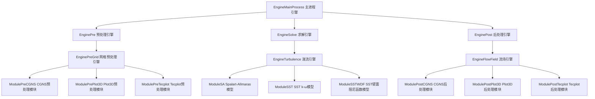
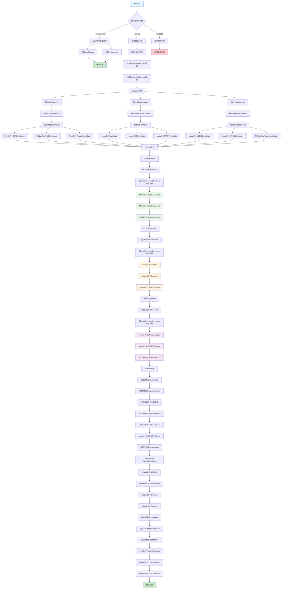

# ParaConfig - 模块化计算流体力学(CFD)配置系统

一个基于C++和JSON的模块化CFD预处理、求解和后处理配置管理系统。

## 项目概述

ParaConfig是一个灵活的配置管理系统，用于管理复杂的CFD工作流程。系统采用分层架构设计，支持模块化配置和动态组合。

### 主要特性

- **模块化设计**: 支持预处理、湍流模型、后处理等各种模块
- **分层引擎**: 从主进程到子引擎的多层次管理
- **JSON配置**: 基于JSON Schema的配置验证和默认值生成
- **动态组合**: 支持模块实例的灵活组合和重用
- **类型安全**: 使用C++17的std::variant确保类型安全

## 系统架构



## 程序执行流程图



## 快速开始

### 编译要求

- C++17或更高版本
- nlohmann/json库
- CMake 3.10+

### 编译步骤

```bash
mkdir build
cd build
cmake ..
make
```

### 基本使用

1. **生成默认配置文件**:
```bash
./paraconfig --write-config ./config
```

这将在`./config`目录下生成:
- `config.json` - 包含所有模块和引擎的默认参数
- `register.json` - 包含所有组件的JSON Schema定义

2. **运行配置**:
```bash
./paraconfig --config ./config/config.json
```

## 配置文件结构

### config.json 示例结构

```json
{
  "EngineMainProcess": {
    "execution_order": ["EnginePre", "EngineSolve", "EnginePost"]
  },
  "EnginePre": {
    "execution_order": ["EnginePreGrid"]
  },
  "EnginePreGrid": {
    "module_execution_order": ["ModulePreCGNS"]
  },
  "ModulePreCGNS": {
    "cgns_type": "HDF5",
    "cgns_value": 15.0
  }
}
```

### 支持的模块类型

#### 预处理模块
- **ModulePreCGNS**: CGNS文件预处理
- **ModulePrePlot3D**: Plot3D文件预处理  
- **ModulePreTecplot**: Tecplot文件预处理

#### 湍流模型模块
- **ModuleSA**: Spalart-Allmaras一方程模型
- **ModuleSST**: SST k-ω两方程模型
- **ModuleSSTWDF**: 带壁面阻尼函数的SST模型

#### 后处理模块
- **ModulePostCGNS**: CGNS文件输出
- **ModulePostPlot3D**: Plot3D文件输出
- **ModulePostTecplot**: Tecplot文件输出

## 高级用法

### 模块实例重用

支持同一模块类型的多个实例:

```json
{
  "EngineFlowField": {
    "module_execution_order": ["ModulePostPlot3D", "ModulePostPlot3D_1", "ModulePostPlot3D_2"]
  },
  "ModulePostPlot3D": {
    "write_q_file": true
  },
  "ModulePostPlot3D_1": {
    "write_q_file": false
  },
  "ModulePostPlot3D_2": {
    "write_q_file": true
  }
}
```

### 引擎重用

支持引擎实例的重用，比如多个后处理阶段:

```json
{
  "EngineMainProcess": {
    "execution_order": ["EnginePre", "EngineSolve", "EnginePost", "EnginePost_1"]
  }
}
```

## 文件结构

```
001/
├── include/
│   └── paraConfig.h          # 主头文件，包含所有类声明
├── source/
│   ├── paraConfig.cpp        # 主实现文件
│   └── main.cpp             # 程序入口点
├── README.md                # 项目文档
└── build/                   # 编译输出目录
```

## API文档

### 核心类

- **EngineMainProcess**: 主进程管理器，协调整个工作流程
- **EnginePre/EngineSolve/EnginePost**: 各阶段的顶层引擎
- **EnginePreGrid/EngineTurbulence/EngineFlowField**: 具体功能引擎
- **Module***: 各种具体功能模块

### 关键方法

每个引擎和模块都实现了统一的接口:
- `Initialize()`: 初始化资源
- `Execute()`: 执行主要逻辑
- `Release()`: 释放资源
- `GetParamSchema()`: 返回参数JSON Schema

## 贡献指南

1. Fork本项目
2. 创建功能分支 (`git checkout -b feature/新功能`)
3. 提交更改 (`git commit -am '添加新功能'`)
4. 推送到分支 (`git push origin feature/新功能`)
5. 创建Pull Request

## 许可证

本项目采用MIT许可证 - 查看[LICENSE](LICENSE)文件了解详情。

## 联系方式

如有问题或建议，请通过GitHub Issues联系。


