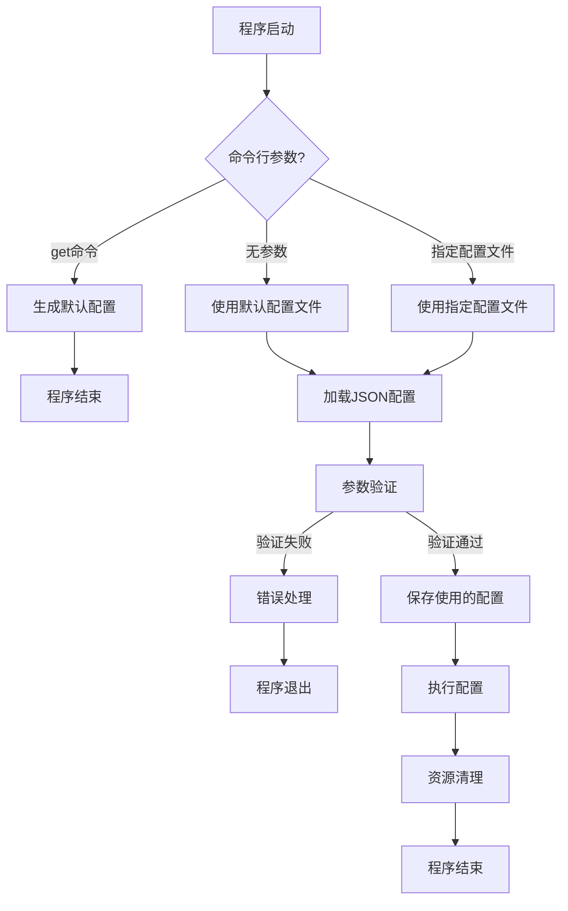
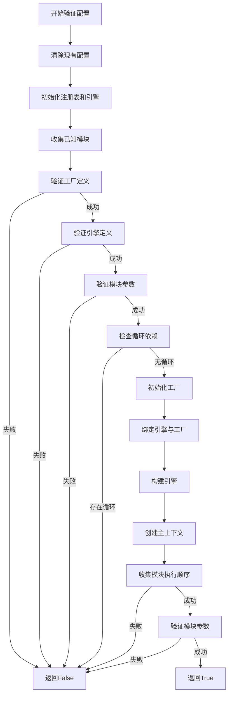
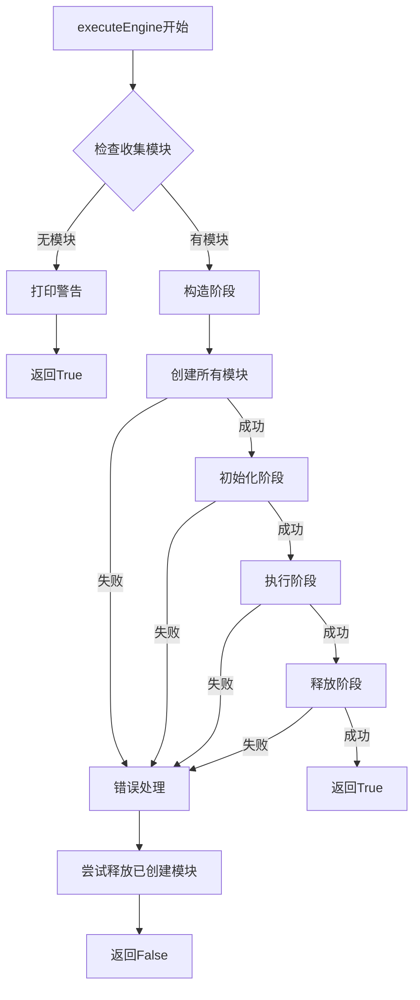
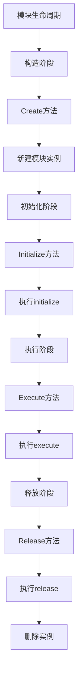
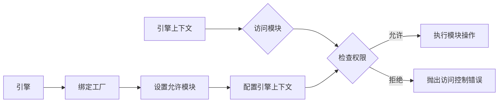
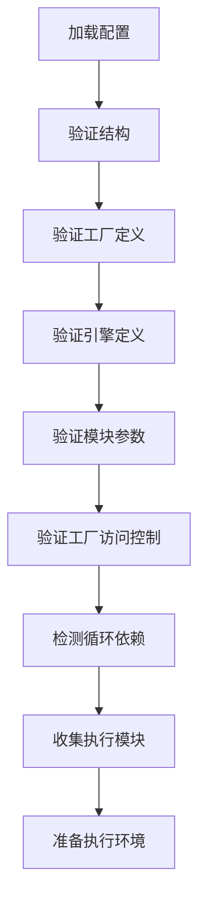

# 高级模块系统文档

## 目录

- [系统概述](#系统概述)
- [架构设计](#架构设计)
- [代码思维模块](#代码思维模块)
- [代码运行逻辑图](#代码运行逻辑图)
- [配置文件格式](#配置文件格式)
- [模块系统使用指南](#模块系统使用指南)
- [命令行参数](#命令行参数)
- [开发者指南](#开发者指南)
- [示例与最佳实践](#示例与最佳实践)
- [常见问题](#常见问题)

## 系统概述

高级模块系统是一个基于 JSON 配置的模块化框架，旨在提供灵活可扩展的模块管理与执行流程。系统通过工厂模式、注册表模式和观察者模式等设计模式，实现了模块的动态加载、生命周期管理以及参数验证功能。

主要特点：

- **模块化架构**：支持模块的独立开发、测试和部署
- **基于 JSON 的配置**：使用 JSON 格式定义模块参数和执行流程
- **严格的参数验证**：提供完整的参数类型和范围检查
- **工厂绑定机制**：通过工厂绑定控制模块的访问权限
- **生命周期管理**：自动管理模块的创建、初始化、执行和释放
- **灵活的引擎系统**：支持嵌套引擎和子引擎执行
- **资源泄漏检测**：自动检测和报告未释放的模块
- **访问控制机制**：确保引擎只能访问其绑定工厂中的模块

## 架构设计

### 核心组件

系统由以下核心组件构成：

1. **AdvancedRegistry**：模块注册表，负责模块的注册、创建、初始化、执行和释放。它维护模块生命周期，并检测资源泄漏。
2. **engineContext**：引擎上下文，提供模块执行环境和参数访问。它控制模块的访问权限，并管理参数传递。
3. **Nestedengine**：嵌套引擎，支持定义和执行引擎工作流。它允许创建复杂的执行流程，包括子引擎嵌套。
4. **ModuleFactory**：模块工厂，负责创建特定类型的模块实例。它通过注册回调函数来管理模块创建。
5. **ModuleFactoryCollection**：模块工厂集合，管理多个命名的模块工厂。它支持不同工厂类型和执行策略。
6. **ModuleTypeRegistry**：模块类型注册表，存储所有可用模块类型及其参数架构。它支持模块自注册和参数验证。
7. **engineExecutionEngine**：引擎执行引擎，处理引擎工作流的执行。它管理构造、初始化、执行和释放的完整生命周期。
8. **ConfigurationStorage**：配置存储，管理系统全局配置和状态。它在验证过程中保存和共享配置信息。

### 组件关系

```
                     ┌───────────────────┐
                     │   ModuleSystem    │
                     └───────────────────┘
                               │
         ┌───────────┬─────────┼─────────┬───────────┐
         │           │         │         │           │
┌────────▼───────┐   │  ┌──────▼─────┐   │  ┌────────▼────────────┐
│AdvancedRegistry│◄──┘  │Nestedengine│   └─►│engineExecutionEngine│
└────────┬───────┘      └──────┬─────┘      └────────┬────────────┘
         │                     │                     │
         │               ┌─────▼──────┐              │
         └───────────────►engineContext◄─────────────┘
                         └────────────┘
                              │
                     ┌────────┴────────┐
            ┌────────▼─────┐      ┌────▼──────────────────┐
            │ModuleFactory │      │ModuleFactoryCollection│
            └────────┬─────┘      └───────────────────────┘
                     │
            ┌────────▼─────────┐
            │ModuleTypeRegistry│
            └────────┬─────────┘
                     │
               ┌─────▼─────┐
               │  Modules  │
               └───────────┘
```

## 代码思维模块

### 设计理念

高级模块系统的代码设计遵循以下核心理念：

1. **关注点分离**：将系统功能划分为明确的模块，每个模块专注于解决特定问题
2. **组合优于继承**：通过组合不同功能模块而非深层继承实现功能扩展
3. **声明式配置**：使用JSON声明系统行为，而非硬编码
4. **静态验证优先**：尽可能在运行前捕获配置和参数错误
5. **可追踪执行流程**：明确记录和报告模块执行的每个步骤
6. **严格生命周期管理**：确保资源按照预定义的生命周期创建和释放
7. **访问控制原则**：应用最小权限原则，限制引擎只能访问其绑定工厂的模块

### 代码组织模式

系统代码组织遵循以下模式：

#### 1. 模块注册模式

```cpp
ModuleTypeRegistry::instance().registerType(
    "ModuleName", 
    []() -> nlohmann::json { return ModuleName::GetParamSchema(); }
);
```

在此模式中，每个模块向中央注册表注册自身，包括名称和参数架构。这实现了：
- 自动发现：系统可以自动列举所有可用模块
- 元数据关联：每个模块关联其配置架构
- 松耦合：模块实现与核心系统分离

#### 2. 工厂与仓库模式

```cpp
factory.registerModuleType("ModuleName", 
    [](AdvancedRegistry* reg, const std::string& name) -> bool { 
        reg->Register<ModuleName>(name);
        return true;
    });
```

此模式通过：
- 将模块创建与使用分离
- 允许运行时决定实例化哪些模块
- 支持不同访问权限策略（通过工厂绑定）
- 实现按需创建和延迟加载

#### 3. 生命周期管理模式

系统严格按照构造→初始化→执行→释放的顺序管理模块生命周期：

```
────────────────────────────────────────────────────────
│  构造阶段   │  初始化阶段  │  执行阶段   │  释放阶段   │
────────────────────────────────────────────────────────
     ↑             ↑             ↑             ↑
     │             │             │             │
  createModule  initialize     execute      release
```

确保：
- 资源得到正确释放
- 状态转换顺序合理
- 自动跟踪和诊断资源泄漏
- 异常发生时正确清理资源

#### 4. 配置验证模式

系统使用自描述的参数架构进行多层次验证：

1. **类型校验**：确保参数类型正确（字符串、数值、布尔等）
2. **范围校验**：数值参数在规定范围内
3. **枚举校验**：字符串参数是有效的枚举值
4. **必要性校验**：所有必需参数都已提供
5. **模块兼容性校验**：确保模块组合有效
6. **工厂访问控制校验**：确保引擎只访问其绑定工厂的模块
7. **循环依赖检测**：防止引擎循环引用

#### 5. 访问控制模式

系统实现了基于工厂的访问控制机制：

```cpp
void engineContext::setAllowedModules(const std::unordered_set<std::string>& modules) {
    allowedModules_ = modules;
}

bool engineContext::canAccessModule(const std::string& moduleName) const {
    return allowedModules_.empty() || allowedModules_.count(moduleName) > 0;
}
```

通过这种方式：
- 引擎只能访问其被绑定工厂中的模块
- 提前验证访问权限，防止运行时错误
- 实现最小权限原则和职责隔离

### 错误处理策略

系统采用多级错误处理策略：

1. **预防**：通过参数架构和验证预防错误
2. **防御式编程**：关键点检查状态和参数
3. **异常处理**：使用std::runtime_error捕获并报告严重错误
4. **恢复机制**：遇到错误时尝试清理已创建的资源
5. **详细日志**：提供清晰的错误上下文和建议
6. **错误分类**：区分配置错误、运行时错误和资源管理错误

### 扩展性设计

系统的扩展机制包括：

1. **新模块添加**：实现特定接口并注册即可添加新模块
2. **参数架构扩展**：每个模块可定义自己的参数需求
3. **执行策略定制**：支持CHOOSE_ONE和SEQUENTIAL_EXECUTION等不同执行策略
4. **工厂分组**：可根据功能或用途分组模块
5. **引擎嵌套**：支持复杂的多级工作流定义
6. **生命周期扩展**：允许模块自定义初始化和释放行为

### 性能考量

代码设计在性能方面考虑了：

1. **延迟加载**：只在需要时创建模块实例
2. **引用传递**：避免大型JSON对象的不必要复制
3. **组件复用**：模块实例和工厂可以在多处使用
4. **内存管理**：明确的生命周期控制，避免泄漏
5. **并行潜力**：允许未来扩展并行执行模块的可能性
6. **冗余验证避免**：缓存验证结果，避免重复验证

## 代码运行逻辑图

### 程序启动流程



### 配置验证流程



### 模块执行流程



### 生命周期管理流程



### 工厂与模块访问控制流程



### 配置处理与验证流程



上述流程图详细展示了系统的主要执行路径，包括程序启动、配置验证、模块执行、生命周期管理以及访问控制等关键流程。这些流程图可以帮助开发者理解系统的运行机制，特别是在处理复杂配置和模块交互时的行为。

## 配置文件格式

配置文件使用 JSON 格式，主要包含以下几个部分：

### 基本配置结构

```json
{
    "config": {
        // 全局参数
        "solver": "SIMPLE",
        "maxIterations": 1000,
        "convergenceCriteria": 1e-6,
        "time_step": 0.01,
        
        // 模块特定参数
        "ModuleName1": {
            "param1": "value1",
            "param2": 123
        }
    },
    
    "moduleFactories": [
        // 工厂定义
    ],
    
    "engineFactoryBindings": [
        // 引擎与工厂绑定关系
    ],
    
    "engine": {
        // 引擎定义
    },
    
    "registry": {
        // 模块注册信息
    }
}
```

### 模块工厂定义

```json
"moduleFactories": [
    {
        "name": "preprocessing_factory",
        "modules": [
            {"name": "PreCGNS", "enabled": true},
            {"name": "PrePlot3D", "enabled": true}
        ],
        "executionType": "CHOOSE_ONE"
    },
    {
        "name": "solver_factory",
        "modules": [
            {"name": "EulerSolver", "enabled": true},
            {"name": "SASolver", "enabled": true},
            {"name": "SSTSolver", "enabled": true}
        ],
        "executionType": "SEQUENTIAL_EXECUTION"
    }
]
```

`executionType` 字段用于指定工厂的执行逻辑：
- `CHOOSE_ONE`：在引擎执行时，只能选择工厂中的一个模块
- `SEQUENTIAL_EXECUTION`：按照工作流定义的顺序依次执行所有启用的模块

### 引擎与工厂绑定

```json
"engineFactoryBindings": [
    {"engineName": "PreGrid", "factoryName": "preprocessing_factory"},
    {"engineName": "Solve", "factoryName": "solver_factory"},
    {"engineName": "Post", "factoryName": "post_factory"},
    {"engineName": "mainProcess", "factoryName": "default"}
]
```

这些绑定关系定义了每个引擎可以访问哪个工厂中的模块，实现了访问控制。

### 引擎定义

```json
"engine": {
    "enginePool": [
        {
            "name": "PreGrid",
            "description": "网格预处理引擎",
            "enabled": true,
            "modules": [
                {"name": "PreCGNS", "enabled": true},
                {"name": "PrePlot3D", "enabled": false}
            ]
        },
        {
            "name": "mainProcess",
            "description": "总控制引擎",
            "enabled": true,
            "subenginePool": ["PreGrid", "Solve", "Post"]
        }
    ]
}
```

引擎定义可以包含：
- 直接使用的模块列表
- 子引擎列表，用于构建复杂的工作流
- 每个引擎和模块都可以单独设置`enabled`属性来控制是否启用

### 模块注册

```json
"registry": {
    "modules": [
        {"name": "PreCGNS", "enabled": true},
        {"name": "EulerSolver", "enabled": true},
        {"name": "PostCGNS", "enabled": true}
    ]
}
```

注册表定义了系统中所有可用的模块，及其是否启用。

## 模块系统使用指南

### 基本使用流程

1. **创建配置文件**：使用 `get` 命令生成默认配置模板
   ```bash
   ./programName get config.json
   ```

2. **修改配置文件**：根据需求调整模块参数、启用/禁用模块和引擎

3. **运行程序**：执行程序，指定配置文件路径
   ```bash
   ./programName config.json
   ```

4. **查看结果**：程序执行后会生成 `config_used.json` 文件，记录实际使用的配置

### 工作流程说明

程序执行时会按照以下流程处理：

1. 加载配置文件
2. 验证配置文件有效性，包括：
   - 结构验证
   - 引擎和工厂定义验证
   - 模块参数验证
   - 访问控制验证
   - 循环依赖检测
3. 初始化模块工厂和引擎
4. 执行主引擎工作流
5. 清理资源，检查泄漏的模块

### 执行阶段

模块的执行遵循以下生命周期：

1. **构造阶段**：创建所有需要的模块实例
2. **初始化阶段**：按照工作流顺序初始化模块
3. **执行阶段**：按照工作流顺序执行模块
4. **释放阶段**：按照工作流的反序释放模块

生命周期状态流转：
```
CONSTRUCTED -> INITIALIZED -> EXECUTED -> RELEASED
```

## 命令行参数

程序支持以下命令行参数：

- 无参数：使用默认配置文件 `./config.json`
  ```bash
  ./programName
  ```

- 指定配置文件：使用指定的配置文件
  ```bash
  ./programName myconfig.json
  ```

- 生成配置模板：生成默认配置文件
  ```bash
  ./programName get [filename.json]
  ```
  如果不指定filename.json，将默认使用 `./config.json`

## 开发者指南

### 添加新模块

要添加新模块，需要完成以下步骤：

1. **定义模块类**：创建新模块类，必须实现以下方法

```cpp
class MyNewModule {
public:
    explicit MyNewModule(const nlohmann::json& params);
    void initialize();
    void execute();
    void release();
    static nlohmann::json GetParamSchema();
private:
    // 私有成员变量
};
```

2. **实现参数特性**：为模块类实现参数特性特化

```cpp
template <> struct ModuleSystem::ModuleParamTraits<MyNewModule> {
    static nlohmann::json GetParamSchema() {
        return MyNewModule::GetParamSchema();
    }
};
```

3. **注册模块类型**：在 `ModuleRegistryInitializer` 中注册模块

```cpp
ModuleTypeRegistry::instance().registerType(
    "MyNewModule", 
    []() -> nlohmann::json { return MyNewModule::GetParamSchema(); }
);
```

4. **添加到模块工厂**：在 `ModuleFactoryInitializer` 中添加模块

```cpp
factory.registerModuleType("MyNewModule", 
    [](AdvancedRegistry* reg, const std::string& name) -> bool { 
        reg->Register<MyNewModule>(name);
        return true;
    });
```

### 模块参数定义

模块参数使用 JSON Schema 格式定义：

```cpp
nlohmann::json MyNewModule::GetParamSchema() {
    return {
        {"param1", {
            {"type", "string"},
            {"description", "描述信息"},
            {"enum", {"Option1", "Option2"}},
            {"default", "Option1"}
        }},
        {"param2", {
            {"type", "number"},
            {"description", "数值参数"},
            {"minimum", 0},
            {"maximum", 100},
            {"default", 50}
        }},
        {"param3", {
            {"type", "boolean"},
            {"description", "布尔参数"},
            {"default", false}
        }},
        {"param4", {
            {"type", "number"},
            {"description", "必需参数"},
            {"required", true}
        }}
    };
}
```

支持的参数类型和验证规则：
- `string`：字符串类型，可选验证规则包括 `enum`（枚举值列表）
- `number`：数值类型，可选验证规则包括 `minimum`（最小值）和 `maximum`（最大值）
- `boolean`：布尔类型
- `array`：数组类型
- `object`：对象类型

每个参数可以设置：
- `description`：参数描述
- `default`：默认值
- `required`：是否必需，默认为false

### 创建自定义引擎

要创建自定义引擎，需要在配置文件中定义引擎，并将其添加到引擎池中：

```json
{
    "name": "CustomEngine",
    "description": "自定义引擎",
    "enabled": true,
    "modules": [
        {"name": "ModuleA", "enabled": true},
        {"name": "ModuleB", "enabled": true, "params": {"customParam": 123}}
    ]
}
```

对于复杂工作流，可以定义包含子引擎的引擎：

```json
{
    "name": "ComplexWorkflow",
    "description": "复杂工作流引擎",
    "enabled": true,
    "subenginePool": ["CustomEngine", "AnotherEngine"]
}
```

## 示例与最佳实践

### 典型配置示例

下面是一个完整的配置文件示例，包含预处理、求解和后处理三个阶段：

```json
{
    "config": {
        "solver": "SIMPLE",
        "maxIterations": 1000,
        "convergenceCriteria": 1e-6,
        "time_step": 0.01,
        
        "PreCGNS": {
            "cgns_type": "HDF5",
            "cgns_value": 15
        },
        
        "EulerSolver": {
            "euler_type": "Standard",
            "euler_value": 0.7
        },
        
        "SASolver": {
            "solver_type": "SA-BC",
            "convergence_criteria": 1e-5,
            "max_iterations": 2000
        }
    },
    
    "moduleFactories": [
        {
            "name": "preprocessing_factory",
            "modules": [
                {"name": "PreCGNS", "enabled": true},
                {"name": "PrePlot3D", "enabled": true}
            ],
            "executionType": "CHOOSE_ONE"
        },
        {
            "name": "solver_factory",
            "modules": [
                {"name": "EulerSolver", "enabled": true},
                {"name": "SASolver", "enabled": true},
                {"name": "SSTSolver", "enabled": true}
            ],
            "executionType": "SEQUENTIAL_EXECUTION"
        },
        {
            "name": "post_factory",
            "modules": [
                {"name": "PostCGNS", "enabled": true},
                {"name": "PostPlot3D", "enabled": true}
            ],
            "executionType": "SEQUENTIAL_EXECUTION"
        }
    ],
    
    "engineFactoryBindings": [
        {"engineName": "PreGrid", "factoryName": "preprocessing_factory"},
        {"engineName": "Solve", "factoryName": "solver_factory"},
        {"engineName": "Post", "factoryName": "post_factory"},
        {"engineName": "mainProcess", "factoryName": "default"}
    ],
    
    "engine": {
        "enginePool": [
            {
                "name": "PreGrid",
                "description": "网格预处理引擎",
                "enabled": true,
                "modules": [
                    {"name": "PreCGNS", "enabled": true}
                ]
            },
            {
                "name": "Solve",
                "description": "求解引擎",
                "enabled": true,
                "modules": [
                    {"name": "EulerSolver", "enabled": true},
                    {"name": "SASolver", "enabled": false}
                ]
            },
            {
                "name": "Post",
                "description": "后处理引擎",
                "enabled": true,
                "modules": [
                    {"name": "PostCGNS", "enabled": true}
                ]
            },
            {
                "name": "mainProcess",
                "description": "总控制引擎",
                "enabled": true,
                "subenginePool": ["PreGrid", "Solve", "Post"]
            }
        ]
    },
    
    "registry": {
        "modules": [
            {"name": "PreCGNS", "enabled": true},
            {"name": "PrePlot3D", "enabled": true},
            {"name": "EulerSolver", "enabled": true},
            {"name": "SASolver", "enabled": true},
            {"name": "SSTSolver", "enabled": true},
            {"name": "PostCGNS", "enabled": true},
            {"name": "PostPlot3D", "enabled": true}
        ]
    }
}
```

### 最佳实践

1. **模块职责单一**：每个模块应专注于单一功能，避免过多依赖
2. **参数验证完整**：定义完整的参数架构，包括类型、范围和默认值
3. **正确管理生命周期**：确保模块在 release 阶段释放所有资源
4. **使用工厂分组**：按功能将相关模块分组到不同工厂中
5. **合理设置执行类型**：
   - `CHOOSE_ONE`：对于互斥的模块（如不同的求解器）
   - `SEQUENTIAL_EXECUTION`：对于需要按顺序执行的模块
6. **避免循环依赖**：确保引擎之间不存在循环依赖关系
7. **引擎绑定工厂**：为每个引擎指定正确的工厂，控制模块访问范围
8. **使用适当的引擎嵌套**：利用子引擎构建复杂工作流
9. **为重要引擎添加描述**：帮助他人理解引擎的用途
10. **管理启用状态**：使用`enabled`属性灵活控制模块启用/禁用

## 常见问题

### Q: 如何查看可用的模块列表？
A: 使用 `get` 命令生成默认配置，其中包含所有可用模块。
```bash
./programName get config.json
```

### Q: 为什么模块执行报错"访问控制错误"？
A: 检查引擎和工厂的绑定关系，确保引擎只访问其绑定工厂中的模块。错误通常如下所示：
```
访问控制错误: 引擎 'EngineName' 尝试创建不属于其绑定工厂的模块 'ModuleName'
```

### Q: 如何检查模块是否有资源泄漏？
A: 程序结束时会自动检查并报告未释放的模块，信息类似：
```
警告: 检测到未释放的模块:
  - ModuleName (状态: EXECUTED)
```

### Q: 工厂类型应该如何选择？
A: 
- 对于需要选择一个实现的模块组（如不同格式的预处理器），使用 `CHOOSE_ONE`
- 对于需要按顺序执行的一组模块，使用 `SEQUENTIAL_EXECUTION`

### Q: 如何调试配置问题？
A: 仔细检查生成的 `*_used.json` 文件，它包含程序实际使用的配置信息。系统会提供详细的错误信息，指出配置中的问题，如：
```
错误: 引擎 'EngineName' 中模块 'ModuleName' 的参数 'paramName' 验证失败: 值必须大于等于10，但获取到5
```

### Q: 如何在配置中覆盖模块默认参数？
A: 在配置文件的`config`部分添加与模块同名的对象，并设置需要的参数：
```json
"config": {
    "ModuleName": {
        "paramName": "newValue"
    }
}
```

### Q: 如何处理循环依赖错误？
A: 当系统检测到引擎间的循环依赖时会报错，需要重新设计工作流结构，确保引擎之间是有向无环图的关系。
