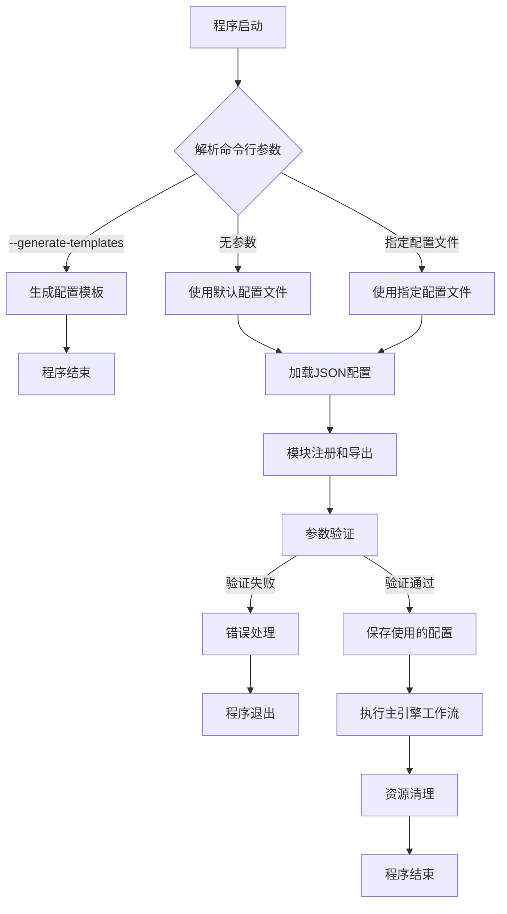
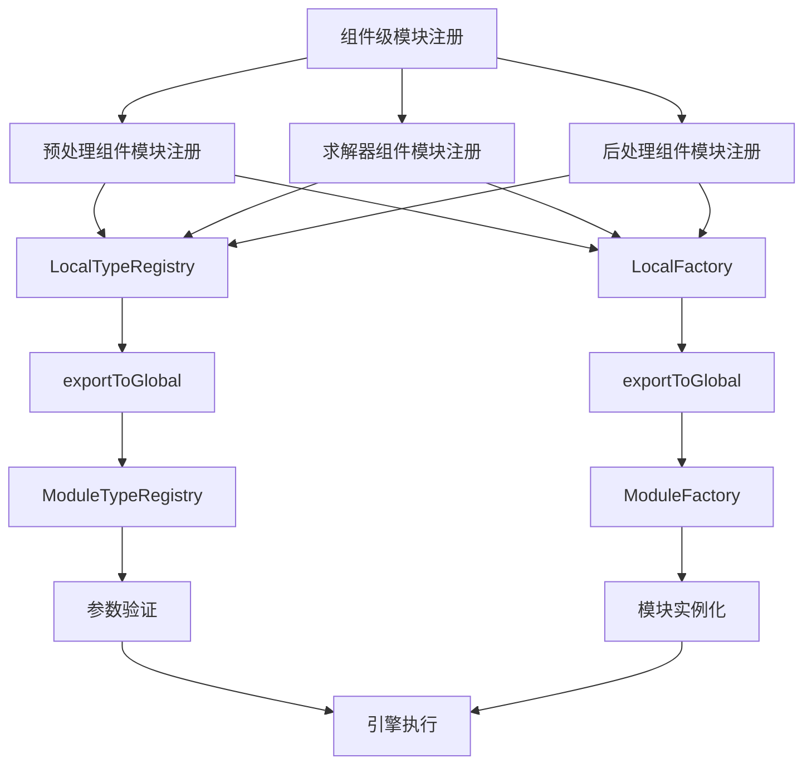
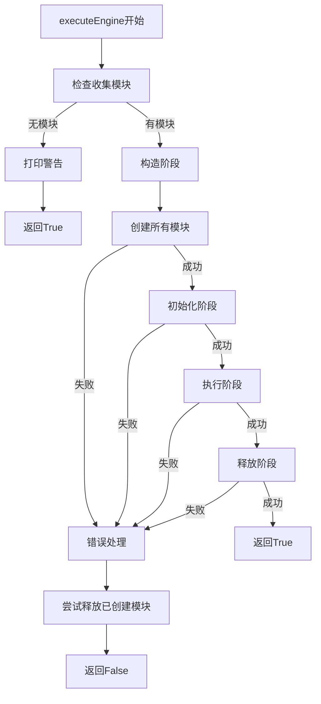
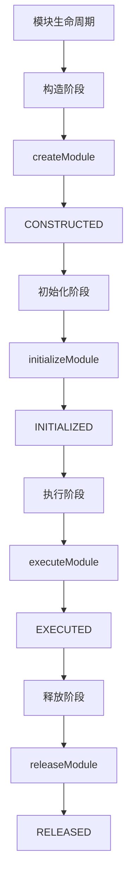
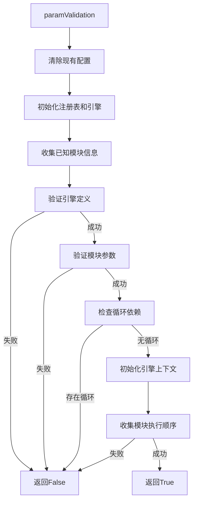

# 高级模块系统文档

## 目录

- [系统概述](#系统概述)
- [架构设计](#架构设计)
- [代码组织结构](#代码组织结构)
- [代码运行逻辑图](#代码运行逻辑图)
- [配置文件格式](#配置文件格式)
- [模块系统使用指南](#模块系统使用指南)
- [命令行参数](#命令行参数)
- [扩展开发指南](#扩展开发指南)
- [示例与最佳实践](#示例与最佳实践)
- [常见问题](#常见问题)
- [故障排除](#故障排除)
- [性能优化](#性能优化)

## 系统概述

ParaConfig是一个基于 JSON 配置的模块化框架，专为流体动力学(CFD)计算参数管理而设计。系统通过工厂模式、注册表模式、生命周期管理等设计模式，实现了模块的动态加载、生命周期管理、参数验证以及引擎嵌套执行等功能。

主要特点：

- **模块化架构**：支持模块的独立开发、测试和部署
- **基于 JSON 的配置**：使用 JSON 格式定义模块参数和执行流程
- **严格的参数验证**：提供完整的参数类型和范围检查
- **工厂绑定机制**：通过工厂绑定控制模块的访问权限
- **生命周期管理**：自动管理模块的创建、初始化、执行和释放
- **灵活的引擎系统**：支持嵌套引擎和子引擎执行
- **资源泄漏检测**：自动检测和报告未释放的模块
- **访问控制机制**：确保引擎只能访问其绑定工厂中的模块
- **本地/全局注册表**：支持组件级别的模块注册和全局导出
- **组件解耦**：实现预处理、求解器和后处理组件的完全解耦

## 架构设计

### 核心组件

系统由以下核心组件构成：

1. **AdvancedRegistry**：模块注册表，负责模块的注册、创建、初始化、执行和释放。它维护模块生命周期，并检测资源泄漏。
2. **engineContext**：引擎上下文，提供模块执行环境和参数访问。它控制模块的访问权限，并管理参数传递。
3. **Nestedengine**：嵌套引擎，支持定义和执行引擎工作流。它允许创建复杂的执行流程，包括子引擎嵌套。
4. **ModuleFactory**：模块工厂，负责创建特定类型的模块实例。它通过注册回调函数来管理模块创建。
5. **ModuleTypeRegistry**：模块类型注册表，存储所有可用模块类型及其参数架构。它支持模块自注册和参数验证。
6. **engineExecutionEngine**：引擎执行引擎，处理引擎工作流的执行。它管理构造、初始化、执行和释放的完整生命周期。
7. **ConfigurationStorage**：配置存储，管理系统全局配置和状态。它在验证过程中保存和共享配置信息。
8. **LocalTypeRegistry** 和 **LocalFactory**：组件级模块注册机制，允许组件独立注册并导出模块到全局系统。
9. **EngineModuleMapping**：引擎与模块的映射管理，实现模块对引擎的归属关系。

### 组件关系

```
                     ┌───────────────────┐
                     │   ModuleSystem    │
                     └───────────────────┘
                               │
         ┌───────────┬─────────┼─────────┬───────────┐
         │           │         │         │           │
┌────────▼───────┐   │  ┌──────▼─────┐   │  ┌────────▼────────────┐
│AdvancedRegistry│◄──┘  │Nestedengine│   └─►│engineExecutionEngine│
└────────┬───────┘      └──────┬─────┘      └────────┬────────────┘
         │                     │                     │
         │               ┌─────▼──────┐              │
         └───────────────►engineContext◄─────────────┘
                         └────────────┘
                              │
                     ┌────────┴────────┐
            ┌────────▼─────┐      ┌────▼──────────────────┐
            │ModuleFactory │      │EngineModuleMapping    │
            └────────┬─────┘      └──────────┬────────────┘
                     │                       │
            ┌────────▼─────────┐     ┌──────▼───────┐
            │ModuleTypeRegistry│     │ConfigStorage │
            └──────────────────┘     └──────────────┘
                     │
           ┌─────────┼─────────┐
           │         │         │
     ┌─────▼───┐┌────▼────┐┌───▼────┐
     │ PreGrid ││ Solve   ││ Post   │
     └─────────┘└─────────┘└────────┘
```

### 组件解耦与依赖关系

ParaConfig采用了组件化设计，主要将系统分为三个主要功能组件：

1. **预处理组件 (PreGrid)**：负责网格处理相关的模块
   - PreCGNS：CGNS格式数据预处理
   - PrePlot3D：Plot3D格式数据预处理

2. **求解器组件 (Solve)**：负责数值求解相关的模块
   - EulerSolver：欧拉方程求解器
   - SASolver：Spalart-Allmaras湍流模型求解器
   - SSTSolver：SST湍流模型求解器

3. **后处理组件 (Post)**：负责结果处理相关的模块
   - PostCGNS：CGNS格式结果后处理
   - PostPlot3D：Plot3D格式结果后处理

这三个组件可以独立编译和开发，通过统一的模块系统接口进行整合。每个组件使用LocalTypeRegistry和LocalFactory实现组件级模块注册，然后通过exportToGlobalRegistry()方法将组件模块导出到全局系统。

## 代码组织结构

### 核心接口设计

ParaConfig使用了接口隔离和依赖倒置原则，关键接口设计如下：

#### 模块接口

所有模块必须实现以下接口：

```cpp
class Module {
public:
    explicit Module(const nlohmann::json& params);  // JSON参数构造函数
    void initialize();                              // 初始化方法
    void execute();                                 // 执行方法
    void release();                                 // 资源释放方法
    static nlohmann::json GetParamSchema();         // 静态参数架构方法
};
```

系统使用ModuleInterfaceChecker在编译时验证模块是否正确实现了所有必需接口。

#### 参数特性接口

每个模块还需要特化ModuleParamTraits以提供参数验证功能：

```cpp
template <> struct ModuleSystem::ModuleParamTraits<Module> {
    static nlohmann::json GetParamSchema() {
        return Module::GetParamSchema();
    }
};
```

#### 本地注册表接口

每个组件使用以下接口进行内部模块管理：

```cpp
// 本地类型注册表和工厂初始化
static ModuleSystem::LocalTypeRegistry localTypeRegistryInstance;
static ModuleSystem::LocalFactory localFactoryInstance;

// 模块注册
void registerTypes() {
    localTypeRegistryInstance.registerType("ModuleName", []() -> nlohmann::json { 
        return Module::GetParamSchema(); 
    });
    
    localFactoryInstance.registerModuleType("ModuleName", 
        [](ModuleSystem::AdvancedRegistry* reg, const std::string& name) -> bool { 
            reg->Register<Module>(name);
            return true;
        });
}

// 导出到全局注册表
void exportToGlobalRegistry() {
    registerTypes();
    localTypeRegistryInstance.exportToGlobal();
    localFactoryInstance.exportToGlobal();
    
    auto& moduleRegistryInit = ModuleSystem::ModuleRegistryInitializer::init();
    moduleRegistryInit.assignModuleToEngine("ModuleName", "EngineName");
}
```

### 生命周期管理模式

系统严格按照构造→初始化→执行→释放的顺序管理模块生命周期：

```
────────────────────────────────────────────────────────
│  构造阶段   │  初始化阶段  │  执行阶段   │  释放阶段   │
────────────────────────────────────────────────────────
     ↑             ↑             ↑             ↑
     │             │             │             │
  createModule  initialize     execute      release
```

每个模块在AdvancedRegistry中都有一个生命周期状态，用于跟踪其当前阶段：

```cpp
enum class LifecycleStage {
    CONSTRUCTED,  // 模块已构造
    INITIALIZED,  // 模块已初始化
    EXECUTED,     // 模块已执行
    RELEASED      // 模块已释放
};
```

### 参数验证系统

系统使用JSON Schema风格的参数定义进行多层次验证：

```cpp
// 参数架构定义示例
nlohmann::json Module::GetParamSchema() {
    return {
        {"param_name", {
            {"type", "string"},              // 参数类型
            {"description", "描述信息"},      // 参数描述
            {"enum", {"选项1", "选项2"}},     // 枚举值（对字符串类型）
            {"default", "默认值"},            // 默认值
            {"required", true}               // 是否必需
        }},
        {"numeric_param", {
            {"type", "number"},
            {"description", "数值参数"},
            {"minimum", 0},                  // 最小值（对数值类型）
            {"maximum", 100},                // 最大值（对数值类型）
            {"default", 50}
        }}
    };
}
```

验证过程包括：

1. **类型校验**：确保参数类型正确（字符串、数值、布尔等）
2. **范围校验**：数值参数在规定范围内
3. **枚举校验**：字符串参数是有效的枚举值
4. **必要性校验**：所有必需参数都已提供
5. **模块兼容性校验**：确保模块组合有效
6. **工厂访问控制校验**：确保引擎只访问其绑定工厂的模块

### 访问控制机制

系统使用基于引擎的模块访问控制，在engineContext中实现：

```cpp
bool engineContext::canAccessModule(const std::string& moduleName) const {
    // 规则1：主引擎可以访问所有模块
    if (engineName_ == "mainProcess") {
        return true;
    }
    
    // 规则2：未绑定的模块对所有引擎可用
    if (!EngineModuleMapping::instance().isModuleBoundToEngine(moduleName)) {
        return true;
    }
    
    // 规则3：引擎只能访问绑定给它的模块或其子引擎的模块
    std::string moduleEngine = EngineModuleMapping::instance().getModuleEngine(moduleName);
    return moduleEngine == engineName_ || isSubEngine(moduleEngine);
}
```

## 代码运行逻辑图

### 程序启动流程



### 模块注册与导出流程



### 模块执行流程



### 生命周期管理流程



### 配置验证流程



## 配置文件格式

配置文件使用 JSON 格式，主要包含以下几个部分：

### 基本配置结构

系统使用多文件配置方式，主要包括：

1. **主引擎配置文件** (`template_engine_mainProcess.json`)：定义主引擎和子引擎关系
2. **子引擎配置文件** (`template_engine_PreGrid.json`, `template_engine_Solve.json`, `template_engine_Post.json`)：定义各引擎的模块和参数
3. **模块注册文件** (`template_registry_module.json`)：定义系统中所有可用模块及其参数架构

以下是各配置文件的基本结构：

#### 主引擎配置

```json
{
    "config": {
        "convergenceCriteria": 1e-06,
        "maxIterations": 1000,
        "solver": "SIMPLE",
        "time_step": 0.01
    },
    "engine": {
        "enginePool": [
            {
                "description": "总控制引擎",
                "enabled": true,
                "name": "mainProcess",
                "subenginePool": [
                    "PreGrid",
                    "Solve",
                    "Post"
                ]
            }
        ]
    }
}
```

#### 子引擎配置

```json
{
    "config": {
        "ModuleName1": {
            "param1": "value1",
            "param2": 50
        },
        "ModuleName2": {
            "param1": "value2",
            "param2": 75
        }
    },
    "engine": {
        "enginePool": [
            {
                "description": "引擎描述",
                "enabled": true,
                "modules": [
                    {"name": "ModuleName1", "enabled": true},
                    {"name": "ModuleName2", "enabled": false}
                ],
                "name": "EngineName"
            }
        ]
    }
}
```

#### 模块注册

```json
{
    "registry": {
        "modules": [
            {
                "enabled": true,
                "name": "ModuleName1",
                "parameters": {
                    "param1": {
                        "type": "string",
                        "description": "参数描述",
                        "enum": ["选项1", "选项2"],
                        "default": "选项1"
                    },
                    "param2": {
                        "type": "number",
                        "description": "数值参数",
                        "minimum": 0,
                        "maximum": 100,
                        "default": 50
                    }
                }
            },
            {
                "enabled": true,
                "name": "ModuleName2",
                "parameters": {
                    // 模块参数架构
                }
            }
        ]
    }
}
```

### 引擎与工厂绑定

模块与引擎的绑定通过代码中的`assignModuleToEngine`方法实现：

```cpp
void exportToGlobalRegistry() {
    // ...
    auto& moduleRegistryInit = ModuleSystem::ModuleRegistryInitializer::init();
    moduleRegistryInit.assignModuleToEngine("PreCGNS", "PreGrid");
    moduleRegistryInit.assignModuleToEngine("PrePlot3D", "PreGrid");
    // ...
}
```

这种绑定关系决定了引擎可以访问哪些模块，并在配置验证和执行时强制执行访问控制策略。

## 模块系统使用指南

### 基本使用流程

1. **生成配置模板**：使用 `--generate-templates` 命令生成默认配置模板
   ```bash
   ./paraConfig --generate-templates ./configs
   ```

2. **修改配置文件**：根据需求调整模块参数、启用/禁用模块和引擎

3. **运行程序**：指定配置文件目录
   ```bash
   ./paraConfig --config-dir ./configs
   ```

4. **查看结果**：程序执行后会在配置目录生成 `config_engine_*.json` 文件，记录实际使用的配置

### 工作流程详解

程序执行时按照以下流程处理：

1. **配置加载与合并**：加载并合并所有配置文件
2. **模块注册**：预处理、求解器和后处理组件注册其模块到全局系统
3. **配置验证**：验证配置有效性（引擎、模块、参数等）
4. **引擎上下文初始化**：为所有引擎创建执行上下文
5. **模块收集**：收集要执行的模块及其执行顺序
6. **引擎执行**：按照构造→初始化→执行→释放的顺序执行所有模块
7. **资源清理**：检查并报告未释放的资源

### 模块执行生命周期

模块执行遵循以下生命周期：

1. **构造阶段**：创建所有需要的模块实例，模块状态为 `CONSTRUCTED`
2. **初始化阶段**：调用模块的 `initialize()` 方法，模块状态转为 `INITIALIZED`
3. **执行阶段**：调用模块的 `execute()` 方法，模块状态转为 `EXECUTED`
4. **释放阶段**：调用模块的 `release()` 方法并释放资源，模块状态转为 `RELEASED`

## 命令行参数

程序支持以下命令行参数：

- **--config-dir [path]**：指定配置文件目录
  ```bash
  ./paraConfig --config-dir ./configs
  ```

- **--generate-templates [path]**：生成配置模板到指定目录
  ```bash
  ./paraConfig --generate-templates ./templates
  ```

如果未指定任何参数，程序将尝试在当前目录查找配置文件。

## 扩展开发指南

### 开发新模块

要添加新模块，需完成以下步骤：

1. **定义模块类**：实现必需的接口方法

```cpp
// 在适当的组件命名空间中（PREGRID、SOLVE或POST）
class MyNewModule {
public:
    explicit MyNewModule(const nlohmann::json& params) {
        // 从params中读取参数
        my_param1_ = params.value("param1", "默认值");
        my_param2_ = params.value("param2", 50);
    }
    
    void initialize() {
        // 初始化逻辑
    }
    
    void execute() {
        // 执行逻辑
    }
    
    void release() {
        // 释放资源
    }
    
    static nlohmann::json GetParamSchema() {
        return {
            {"param1", {
                {"type", "string"},
                {"description", "参数1描述"},
                {"enum", {"选项1", "选项2"}},
                {"default", "选项1"}
            }},
            {"param2", {
                {"type", "number"},
                {"description", "参数2描述"},
                {"minimum", 0},
                {"maximum", 100},
                {"default", 50}
            }}
        };
    }
    
private:
    std::string my_param1_;
    int my_param2_;
};
```

2. **特化参数特性**：在ModuleSystem命名空间中

```cpp
namespace ModuleSystem {
    template <> struct ModuleParamTraits<COMPONENT::MyNewModule> {
        static nlohmann::json GetParamSchema() {
            return COMPONENT::MyNewModule::GetParamSchema();
        }
    };
}
```

3. **注册模块**：在组件的registerTypes方法中

```cpp
void registerTypes() {
    // ...现有代码...
    
    localTypeRegistryInstance.registerType("MyNewModule", 
        []() -> nlohmann::json { return MyNewModule::GetParamSchema(); });
    
    localFactoryInstance.registerModuleType("MyNewModule", 
        [](ModuleSystem::AdvancedRegistry* reg, const std::string& name) -> bool { 
            reg->Register<MyNewModule>(name);
            return true;
        });
}
```

4. **关联到引擎**：在组件的exportToGlobalRegistry方法中

```cpp
void exportToGlobalRegistry() {
    // ...现有代码...
    
    auto& moduleRegistryInit = ModuleSystem::ModuleRegistryInitializer::init();
    moduleRegistryInit.assignModuleToEngine("MyNewModule", "EngineName");
}
```

### 开发新组件

要创建全新的功能组件，需要：

1. **创建组件头文件和源文件**：
   - `include/my_component.h`
   - `source/my_component.cpp`

2. **定义组件命名空间和模块**：

```cpp
namespace MYCOMPONENT {
    // 声明本地注册表和工厂
    extern ModuleSystem::ModuleTypeRegistry* localTypeRegistry;
    extern ModuleSystem::ModuleFactory* localFactory;
    
    // 声明初始化和导出函数
    void initializeFactory();
    void registerTypes();
    const auto& getTypes();
    const auto& getFactories();
    void exportToGlobalRegistry();
    
    // 声明组件模块
    class Module1 { /* ... */ };
    class Module2 { /* ... */ };
}
```

3. **实现组件函数和模块**：遵循现有组件的模式实现各函数

4. **修改主程序**：在main.cpp中添加组件的导出

```cpp
int main(int argc, char* argv[]) {
    // ...现有代码...
    
    // 导出新组件
    MYCOMPONENT::exportToGlobalRegistry();
    
    // ...现有代码...
}
```

5. **构建系统**：确保新的组件源文件和头文件被正确添加到项目的构建系统 (如 CMakeLists.txt) 中。

## 示例与最佳实践

### 典型配置示例

本系统已包含主要组件的配置示例模板，当执行 `--generate-templates` 时会生成这些文件：

1.  **预处理引擎配置**：`template_engine_PreGrid.json`
2.  **求解器引擎配置**：`template_engine_Solve.json`
3.  **后处理引擎配置**：`template_engine_Post.json`
4.  **主引擎配置**：`template_engine_mainProcess.json` (包含全局参数 `GlobalConfig` 和主工作流定义)
5.  **模块注册表配置**：`template_registry_module.json` (定义系统中所有可识别的模块及其默认启用状态)

这些文件可以作为配置的起点，根据需要进行调整。实际运行时，程序会从 `--config-dir` (默认为 `./config/`) 加载名为 `config_*.json` 的文件。

### 最佳实践

1.  **模块设计原则**：
    *   **单一职责**：每个模块应专注于一个特定的功能。
    *   **清晰接口**：模块应提供明确的构造函数 (接受 `nlohmann::json` 参数)、`initialize()`、`execute()`、`release()` 方法和静态的 `GetParamSchema()` 方法。
    *   **无状态性**：尽量设计无状态模块，或通过 `initialize()` 和参数传入来管理状态。
    *   **错误处理**：模块内部应妥善处理异常，并在必要时抛出标准异常。
    *   **资源管理**：在 `release()` 方法中确保所有分配的资源得到释放。

2.  **组件化开发流程**：
    为了更好地组织和管理模块，推荐采用组件化的开发方式。一个组件通常包含一组功能相关的模块。
    *   **创建命名空间**：为组件定义一个独立的C++命名空间，例如 `MYCOMPONENT`。
    *   **定义模块**：在组件的头文件 (`.h`) 中声明模块类，包括其构造函数、生命周期方法和 `GetParamSchema` 方法。同时，特化 `ModuleSystem::ModuleParamTraits`。
    *   **实现模块与注册逻辑**：
        *   在组件的源文件 (`.cpp`) 中实现模块的具体逻辑。
        *   在源文件中，为该组件创建静态的 `ModuleSystem::LocalTypeRegistry` 和 `ModuleSystem::LocalFactory` 实例。
        *   实现一个内部的 `registerComponentModules()` (或类似名称) 函数，在此函数中：
            *   使用 `localTypeRegistryInstance.registerType()` 注册模块的名称和获取其参数架构的lambda。
            *   使用 `localFactoryInstance.registerModuleType()` 注册模块的名称和创建其实例的lambda (该lambda内部调用 `reg->Register<YourModuleType>(name);`)。
    *   **导出到全局**：
        *   在组件的头文件中声明一个导出函数，如 `void exportToGlobalRegistry();`。
        *   在组件的源文件中实现此函数。该函数首先调用内部的 `registerComponentModules()`，然后调用 `localTypeRegistryInstance.exportToGlobal()` 和 `localFactoryInstance.exportToGlobal()`，将本地注册的类型和工厂方法导出到全局单例中。
        *   可选地，在此函数中使用 `ModuleSystem::ModuleRegistryInitializer::init().assignModuleToEngine("MyModuleName", "DefaultEngineName");` 为模块指定一个默认关联的引擎。
    *   **主程序集成**：
        *   在 `main.cpp` (或其他合适的初始化位置) `#include` 组件的头文件。
        *   在 `main()` 函数的早期阶段，调用组件的 `exportToGlobalRegistry()` 函数。
    *   **构建系统**：确保新的组件源文件和头文件被正确添加到项目的构建系统 (如 CMakeLists.txt) 中。

3.  **配置管理**：
    *   **分离配置**：将引擎定义、模块参数和模块注册信息分别存储在不同的JSON文件中，便于管理和维护。
    *   **版本控制**：将配置文件纳入版本控制系统。
    *   **模板优先**：先使用 `--generate-templates` 生成最新的配置模板，再进行修改，以确保配置结构与程序版本兼容。

4.  **参数定义**：
    *   在模块的 `GetParamSchema()` 方法中，为每个参数提供明确的 `type`、`description`，并尽可能使用 `default`、`enum`、`minimum`、`maximum` 等约束，以利用系统的参数校验功能。

## 常见问题

### Q: 如何添加新的参数到现有模块？
A: 修改模块的GetParamSchema方法，添加新参数定义，并在构造函数中处理该参数。

### Q: 引擎执行顺序如何确定？
A: 引擎执行顺序由主引擎配置中的subenginePool数组顺序决定。系统按照数组中定义的顺序依次执行子引擎。

### Q: 为什么模块执行报"访问控制错误"？
A: 检查模块是否通过assignModuleToEngine正确关联到了引擎。引擎只能访问关联给它的模块或未关联任何引擎的全局模块。

### Q: 如何更改模块的执行顺序？
A: 在引擎配置中，modules数组的顺序决定了模块的执行顺序。调整数组顺序可以改变执行顺序。

### Q: 配置验证失败如何排查？
A: 查看错误信息，它会指出具体的验证失败原因，如参数类型不匹配、缺少必需参数、参数值超出范围等。然后检查相应的配置部分。

## 故障排除

### 模块找不到

**症状**：执行时提示"Module not found"

**可能原因**：
- 模块名称拼写错误
- 模块未在registry.modules中启用
- 模块未被正确导出到全局注册表

**解决方法**：
- 检查模块名称拼写
- 确认在registry.modules中该模块enabled为true
- 确认对应组件的exportToGlobalRegistry函数正确调用并执行

### 参数验证失败

**症状**：执行时提示"参数验证失败"

**可能原因**：
- 参数类型不匹配（如字符串类型传入了数值）
- 数值参数超出范围
- 字符串参数不在允许的枚举值列表中
- 缺少必需参数

**解决方法**：
- 检查配置文件中参数的类型和值
- 参考模块的GetParamSchema获取参数约束
- 修正参数值或使用默认值

### 资源泄漏

**症状**：程序结束时提示"检测到未释放的模块"

**可能原因**：
- 模块的release方法抛出异常
- 引擎执行过程中发生错误导致释放阶段未执行

**解决方法**：
- 检查模块的release方法实现
- 检查执行日志，查找可能导致引擎执行中断的错误

### 引擎循环依赖

**症状**：配置验证时提示"检测到循环依赖"

**可能原因**：
- 引擎之间存在循环引用关系（A依赖B，B又依赖A）

**解决方法**：
- 重新设计引擎层次结构，消除循环依赖
- 可能需要引入中间引擎或调整功能分配

## 性能优化

### 配置优化

1. **精简配置**：
   - 禁用不需要的模块（设置enabled为false）
   - 删除未使用的引擎
   - 合并功能相似的模块

2. **执行策略**：
   - 对计算密集型模块使用专门的引擎，以便将来支持并行执行
   - 关注模块间的数据依赖，合理安排执行顺序

### 内存优化

1. **资源管理**：
   - 确保模块的release方法及时释放占用的资源
   - 避免在模块构造函数中分配大量资源，推迟到initialize阶段分配
   - 在release阶段彻底清理所有分配的内存和句柄，防止内存泄漏
   - 使用智能指针（如std::unique_ptr、std::shared_ptr）管理动态分配的对象，减少手动delete的风险

2. **模块生命周期优化**：
   - 避免重复创建和销毁同一模块实例，合理复用模块对象
   - 在模块执行完毕后立即释放不再需要的资源，缩短资源占用时间
   - 定期检查未释放的模块，利用系统的资源泄漏检测机制

3. **数据结构选择**：
   - 优先选择轻量级的数据结构，避免不必要的深拷贝
   - 对于大数据对象，考虑使用引用或指针传递，减少内存占用

4. **并发与多线程**（如有扩展）：
   - 多线程场景下注意线程安全，避免竞态条件导致的资源泄漏
   - 合理划分线程生命周期，及时回收线程相关资源

---

如需进一步了解模块开发、配置管理或系统扩展，请参考各组件源码及示例配置文件。遇到问题可查阅“常见问题”和“故障排除”章节，或在项目仓库提交issue。

---
